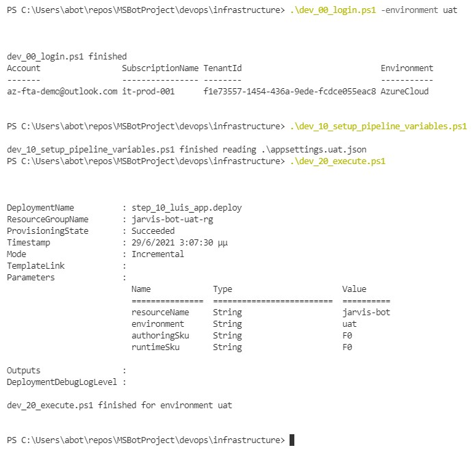

# Resource deployment

In this section we are deploying azure resources:

- [Powershell's Az module](https://docs.microsoft.com/en-us/powershell/azure/install-az-ps)
- [To check security use AzSK](https://azsk.azurewebsites.net/00a-Setup/Readme.html)

In order to protect sensitive info like usernames and passwords a `appsettings.{environment}.json` file needs to be added in this folder.
The contents of this file has the following records for the login and any additional variable you need for your scripts.

``` json
{  
    "TenantId": "xxxxxxxx-xxxx-xxxx-xxxx-xxxxxxxxxxxx",  
    "SubscriptionId": "xxxxxxxx-xxxx-xxxx-xxxx-xxxxxxxxxxxx"
}
```

To deploy the resources from your local machine, you have to execute the following powershell scripts:

- dev_00_login.ps1: Needs to be executed once in order to login in the current terminal window.
- dev_10_setup_test_release_variables.ps1: Configures environment variables that are normally configured within Azure DevOps
- dev_20_deploy.ps1: Executes the needed steps to deploy the resources.



## Deploying an environment

Let's assume you have a `appsettings.uat.json` file for the UAT environment. The contents of that file would be the following:

``` json
{
  "TenantId": "xxxxxxxx-xxxx-xxxx-xxxx-xxxxxxxxxxxx",
  "SubscriptionId": "xxxxxxxx-xxxx-xxxx-xxxx-xxxxxxxxxxxx",
  "ResourceGroupName": "jarvis-bot-uat-rg",
	"... more settings here ..." : "..."
  }
}

```

In order to deploy the environment you would issue the following commands:

``` powershell
.\dev_00_login.ps1 -environment uat
.\dev_10_setup_pipeline_variables.ps1
.\dev_20_execute.ps1
```

## Powershell

The resource deployment is using the Az powershell module. In order to execute powershell azure related scripts you need to install the following modules:

``` powershell
# Install the Az modules
# See more in https://docs.microsoft.com/en-us/powershell/azure/install-az-ps
Install-Module -Name Az -AllowClobber -Scope CurrentUser
```

To execute not signed powershell scripts in your host you will have to disable signature checking

``` powershell
Set-ExecutionPolicy -Scope Process -ExecutionPolicy Bypass
```

This will affect only the current terminal. To apply to user, set scope to `CurrentUser`. [Read more about Set-ExecutionPolicy](https://docs.microsoft.com/en-us/powershell/module/Microsoft.PowerShell.Security/Set-ExecutionPolicy).

